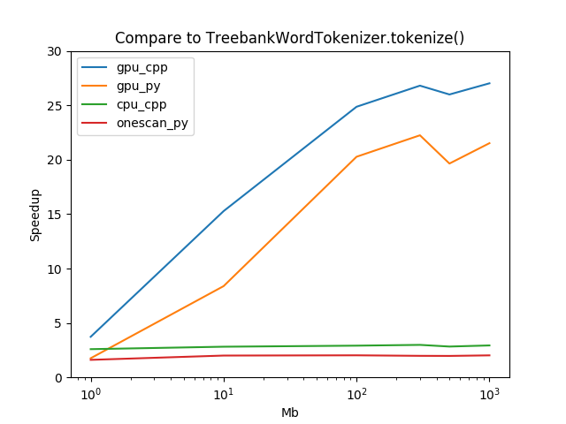

# Fast Tokeizers
Fast and rule-based tokenizers are implemented in C++ with Cuda and Python with Pycuda. The rules are producing Penn Treebank style tokenization of English text and following the rules similar to nltk's TreebankWordTokenizer(http://www.nltk.org/_modules/nltk/tokenize/treebank.html). The fastest tokenizer can be up to 28X speedup comparing to nltk's TreebankWordTokenizer.

-
### 1. Application Overview
GpuTokenize.py
  * Python and Pycuda application
  * uses Pycuda to tokenize a large input string into tokens.

Onescan.py
  * Python application	
  * implements the PTB rules to tokenize a large string during one scan.

GpuTokenize.cu and GpuTokenize.h
  * C++ and Cuda application.
  * provides splitAndSaveToFile() or split() to tokenize a large input string into tokens.

CpuTokenize.cpp and CpuTokenize.h
  * C++ application	
  * provides splitAndSaveToFile_cpu() or split_cpu() to tokenize a large input string into tokens.
  
-
### 2. Folder and Files
Current folder:
  * test.sh, Myplot.py, Compare2PTB.py and README.md
  
Folder 'cpp':
  * GpuTokenize.cu, GpuTokenize.h, CpuTokenize.cpp, CpuTokenize.h, Tok.cpp, Tok.h, Main.cpp and Makefile
  
Folder 'py':
  * GpuTokenize.py, Onescan.py and runtok.py

-
### 3. Data
dataset 1: www.gutenberg.org/ebooks/20417 www.gutenberg.org/ebooks/5000 www.gutenberg.org/ebooks/4300  
dataset 2: http://cmpt732.csil.sfu.ca/datasets/a1-pagecounts-2.zip

-
### 4. Running the Application
Assuming Cuda and Pycuda are installed. 

1) running C++:
  * cd /path_to_cpp/cpp
  * make
  * ./tok path_to_data 
   
2) running Python:
  * cd /path_to_cpp/cpp
  * python runtok.py path_to_data

3) running test.sh:
  * Adjust the data paths in test.sh and then 
  * ./test.sh

-
### 5. The basic idea for Gpu implementation
It takes 2 steps to tokenize. The first is patching, in which each byte is patched with left and right bytes. Allowing each GPU thread to work with one bytes, the left or right bytes of this byte is marked as "joined" or "disjoined" according to the rules.
The final step is to remove the patched "joined" bytes and split the tokens simultaneously.
 
-
### 6. Accuracy
All results from above Python applications are matched to the result from nltk's TreebankWordTokenizer. The C++ Gpu version have difficulty to handle a long repeating pattern since each byte in GPU thread only can see limited neighbors (window size is a fixed number).

-
### 7. Results
Comparing to the nltk's TreebankWordTokenizer, the CPU versions are about 2x speedup while the GPU versions are 25x to 28x as shown below:

